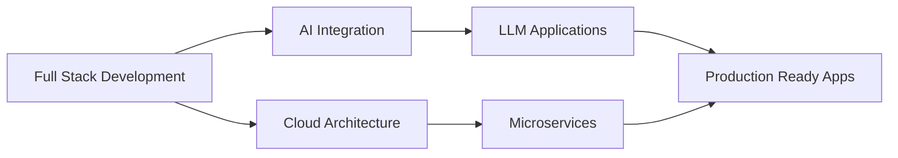

<!--   my-icons -->
<p align="center">
    <a href="https://github.com/HarshSharma0801"></a>
    <a href="https://github.com/pulls?q=is%3Aclosed+author%3AHarshSharma0801"></a>
    <a href="https://github.com/HarshSharma0801"></a>
    <a href="https://github.com/HarshSharma0801/HarshSharma0801/graphs/contributors"></a>
    <a href="https://github.com/HarshSharma0801?tab=followers"></a>
    <a href="https://github.com/HarshSharma0801/HarshSharma0801/stargazers"></a>
    <a href="https://github.com/HarshSharma0801/HarshSharma0801/network/members"></a>
    
</p>

<!--   my-ticker -->    
[](https://git.io/typing-svg)

## 🚀 About Me

```typescript
const harsh = {
    role: "Builder (Anything)",
    expertise: [
        "Full Stack Development",
        "AI/ML Engineering", 
        "Cloud Architecture & DevOps",
        "Mobile Application Development",
        "System Design & Scalability"
    ],
    specialization: [
        "Microservices Architecture",
        "LLM Integration & AI Solutions",
        "CI/CD Pipeline Automation",
        "Cross-Platform Mobile Apps"
    ],
    currentFocus: "Building production-grade scalable systems with AI integration",
    philosophy: "Architect. Build. Scale. Repeat. 🚀"
};
```

---

## 📊 GitHub Statistics

<p align="center">
  <a href="https://github.com/pulls?q=is%3Apr+author%3AHarshSharma0801">
    
  </a>
  <a href="https://github.com/search?q=author%3AHarshSharma0801&type=commits">
    
  </a>
  <a href="https://github.com/HarshSharma0801?tab=repositories">
    
  </a>
  <a href="https://github.com/issues?q=author%3AHarshSharma0801">
    
  </a>
</p>

<p align="center">
  <a href="https://github.com/HarshSharma0801">
    
  </a>
  <a href="https://github.com/HarshSharma0801">
    
  </a>
  <a href="https://github.com/HarshSharma0801">
    
  </a>
</p>

---

<!--   my-skils -->

| Property | Data |
|-------------------------------------------------|-----------------------------------------------------------------------------------------------------------------------------------------------------------------------------------------------------------------------------------------------------------------------------------------------------------------------------------------------------------------------------------------------------------------------------------------------------------------------------------------------------------------------------------------------------------------------------------------------------------------------------------------------------------------------------------------------------------------------------------------------------------------------------------------------------------------------------------------------------------------------------------------------------------------------------------------------------------------------------------------------------------------------------------------------------------------------------------------------------------------------------------------------------------------------------------------------------------------------------------------------------------------------------------------------------------------------------------------------------------------------------------------------------------------------------------------------------------------------------------------------------------------------------------------------------------------------------------------------------------------------------------------------------------------------------------------------------------------------------------------------------------------------------------------------------------------------------------------------------------------------------------------------------------------------------------------------------------------------|
| **Frontend Development** |         |
| **Backend Development** |         |
| **Mobile Development** |    |
| **AI & Machine Learning** |       |
| **Databases** |        |
| **DevOps & Cloud** |             |
| **Programming Languages** |      |
| **Tools & IDE** |       |

---

<!--   GitHub stats graph -->
### 📈 GitHub Activity Graph:

<!--   green snake -->


<!--   stats + languages -->
<p align="center">
  
</p>

</img>

<!-- dark snake -->


<!--   profile-green-animate -->


<p align="center">
  
</p>

<div align="center">
<summary>Trophy: Github Profile Trophy</summary>
</div>

<p align="center"> 
<a href="https://github.com/ryo-ma/github-profile-trophy"></a>
</p>

---

## 🎯 Current Focus



---

**📫 How to Reach me:**
<p align="center">
  <a href="https://github.com/HarshSharma0801"></a>
  <a href="https://www.linkedin.com/in/harshsharma0801/"></a>
  <a href="https://x.com/home"></a>
  <a href="mailto:harshsharma08012004@gmail.com"></a>
</p>

---

#### Thanks for visiting :heart:

<p align="center"> 

</p>

---

<p align="center">
  
</p>

<p align="center">
  ⭐️ From <a href="https://github.com/HarshSharma0801">HarshSharma0801</a> | Made with ❤️ and ☕
</p>
